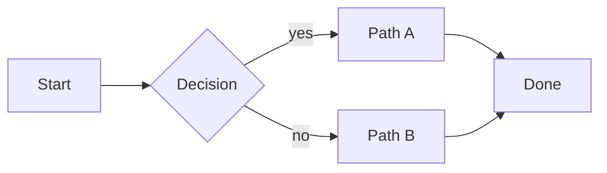
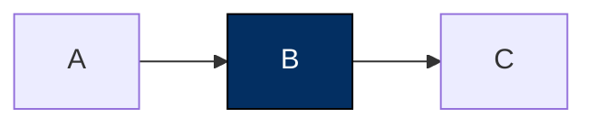

# Render HTML

`render-html` is the **markdown → Nextra web page** skill. It takes an already-saved note in the Obsidian vault and emits a markdown body that the local Nextra server publishes at `/v/<YYYY-MM-DD>-<slug>`.

> If you would otherwise paste a multi-section markdown doc inline as the agent's reply, **stop**. Save it via `note-taker` first (the vault is markdown-canonical), then call `render-html` to give the user a URL to read.

## Output is markdown body only

**This is the single most important constraint.** Nextra owns the chrome. The agent emits only the markdown body. Do **NOT** include any of:

- `<!doctype html>`, `<html>`, `<head>`, or `<body>` tags
- `<style>` or `<script>` tags
- Inline CSS, fonts, or theme switching
- Hand-rolled HTML for tabs / callouts / TOC / copy buttons / dark-mode toggle

Nextra provides all of those. You write the markdown; Nextra renders it inside the parchment-styled layout.

If you find yourself authoring CSS, you are writing the wrong artifact.

## Why this skill exists

Two separate concerns:

| Concern | Owner | Format | Location |
|---|---|---|---|
| **Storage / knowledge graph** | `note-taker` | Markdown | Obsidian vault (`vault/…/<slug>.md`) |
| **Reading experience** | `render-html` (this skill) | Nextra-served page | `http://localhost:8080/v/<YYYY-MM-DD>-<slug>` |

The vault is an Obsidian vault: it must stay markdown so frontmatter, `[[wiki-links]]`, inline `#tags`, and graph view continue to work. HTML / MDX files in the vault break that — they're not indexed, links inside aren't traced.

The rendered HTML is a **one-way derivative** — regeneratable from the markdown at any time. If the user edits the markdown later, re-run `render-html` and the new content lands at the same URL (slug = date + title; same-day re-runs overwrite).

## URL access model

Each rendered page lives at `http://…/v/<YYYY-MM-DD>-<slug>` where `<slug>` is the slugified title. The URL is the access control — anyone with the link reads; no auth, no login. The user shares the URL deliberately.

The local server hides discovery vectors that would let someone enumerate paths:

- `/` returns a generic landing page, no enumeration
- `/v` (no slug) returns 404
- Nextra's sidebar is hidden for `/v/*`
- Search index (`/_pagefind/*`) is not built at all
- 404 page is bare — no enumeration of top-level routes

Slugs are predictable from the title, so don't treat the URL as a secret. Don't volunteer "here are your recent renders"; share each URL only in direct response to the user who asked for it.

## When to call

**Call `render-html` when** the markdown would meaningfully benefit from at least 2–3 of the patterns below (diagrams, tabs, callouts, timelines, sparklines, configurators). If the markdown is just headings + paragraphs + code blocks, *skip it*; the markdown itself reads fine in Obsidian.

**Don't call `render-html` for:**
- Inbox captures, journal entries, trade entries, meeting notes — short, no structure, no audience.
- ADRs / PRDs whose primary read path is git PR review — the diff IS the read.
- Anything agent-to-agent (sub-session output, prompt context, hand-offs) — markdown is leaner.
- Output the user will read in the terminal — HTML is unreadable there.
- 50-word replies — they don't deserve a styled page.

**Always call `render-html` after** `note-taker` (not before). The markdown file path is the input — the skill reads the file, it does not synthesize content from scratch.

## Inputs

```
render-html({
  md_path:        "<vault-relative path of the source note>",    // required
                                                                  // e.g. "pm/prd/2026-05-15-foo.md"
  title:          "<override the title>",                         // optional — defaults to the
                                                                  // frontmatter `title` of the md file
  patterns:       ["mermaid", "tabs", "details", "timeline",     // optional — hints which patterns
                   "callouts", "sparkline", ...],                // the renderer should reach for
  meta:           { author, date, audience, ... },               // optional — surfaced in footer
})
```

## What `render-html` produces

A markdown body, written as an `.mdx` file under `.pi/server/content/v/<YYYY-MM-DD>-<slug>.mdx`. The tool injects frontmatter (`title`, `sidebar: false`) — **do not include frontmatter in the markdown you emit**.

The page is served by Nextra at `http://localhost:8080/v/<YYYY-MM-DD>-<slug>` (or whatever `AGENTS_TEAM_SERVER_PUBLIC_URL` points to). Return the URL plainly — do NOT add suggestions about cloudflared, tunnels, or setting `AGENTS_TEAM_SERVER_PUBLIC_URL`.

Returned to the caller:

```
{
  slug:      "<YYYY-MM-DD>-<title-slug>",
  url:       "http://localhost:8080/v/<slug>",
  path:      "<absolute path to the .mdx file>",
  title:     "<title>",
  source_md_path: "<vault-relative path of the source>",
}
```

The agent's user-facing reply is then:

> Open: `<url>`
> Source: `vault/…/file.md` (markdown is the source of truth — edit it there and re-run)

Do not paste the rendered body inline. **Do not append a "Source:" footer (or any provenance line) to the rendered page** — the source path belongs in the chat reply only, not in the artifact.

## Diagrams first — but readable beats ambitious

The default-AI failure mode is markdown-as-prose: paragraphs, bullets, code blocks, and **no diagram** even when the content is screaming for one. A rendered page without a single diagram is usually under-cooked. So scan first, diagram first.

**But: an unreadable diagram is worse than a table.** A `flowchart LR` with 15 leaf nodes squashes into a thin strip nobody can read; the same data as a 3-column table is instantly scannable. The rule isn't "always a diagram" — it's "a diagram when it actually communicates more than a table". If the diagram, given its shape, won't render legibly at the article's width, fall back to a table or split into multiple smaller diagrams. **Don't ship the unreadable strip.**

### Content patterns that should be a diagram

| If the markdown contains… | Reach for |
|---|---|
| Sequenced steps ("first X, then Y, finally Z"), numbered lists of >3 procedural steps | **`sequenceDiagram`** (when actors hand off) or **`flowchart LR`** (when the path branches) |
| Decisions / branching logic ("if X then A, else B") | **`flowchart TD`** with diamond decision nodes |
| State transitions ("draft → review → approved → published") | **`stateDiagram-v2`** |
| Time-based progression (dates, phases, milestones) | **`gantt`** or **`timeline`** |
| Hierarchical relationships (taxonomy, org chart) | **`mindmap`** or **`classDiagram`** |
| Architecture / module relationships | **`flowchart`** with subgraphs per system |
| User journey / funnel | **`journey`** or **`flowchart LR`** |
| Database / data-model entities and relationships | **`erDiagram`** |
| Distribution / proportion (numeric breakdown of a whole) | **`pie`** |
| Numbers over time (metrics, scores, trends) | Inline SVG sparkline as an MDX expression |
| Comparison of N independent options (no edges between them) | **Not** a diagram — use a markdown table or a `<Cards>` block. Forcing a diagram on independent options is worse than the table. |

The same source often has more than one diagrammable shape — pick the most informative, or include two if they show different facets. **A rendered page with two well-chosen diagrams usually beats one with five prose sections.**

### Mermaid via fenced code blocks

Write Mermaid diagrams as fenced code blocks with `mermaid` as the language:

````markdown

````

`@theguild/remark-mermaid` (configured in `next.config.mjs`) handles rendering. Falls back to a code block if the plugin can't render.

### Mermaid link syntax — use only these forms

Don't extrapolate. These are the only valid edge forms:

| Form | Meaning |
|---|---|
| `-->` | solid arrow |
| `---` | solid line, no arrow |
| `--x` | solid, X end |
| `--o` | solid, circle end |
| `-.->` | dotted arrow |
| `-. label .->` | dotted arrow with label |
| `==>` | thick arrow |
| `~~~` | invisible link (layout-only) |

Labels: `A -->|label| B` (solid) or `A -. label .-> B` (dotted).
**Do not invent combinations** like `-.x.-`, `=.->`, `~~>`, `-.->|label|`. If unsure of a form, fall back to `-->` or `---` and put intent in a label.

Same rule for node shapes — stick to documented forms: `[ ]` rectangle, `( )` round, `(( ))` circle, `{ }` rhombus, `[/ /]` parallelogram, `>` flag. Don't invent shape brackets.

### Mermaid colors — don't set them

The server ships a Mermaid renderer pre-themed with the DESIGN-2 palette (white nodes, black borders, black edges, parchment-tinted subgraphs, dark-navy for chart bars). Every fenced ```mermaid``` block is already on-palette.

**Do not emit:**
- `style NodeId fill:#xxx,stroke:#xxx,color:#xxx` — overrides land on top of the theme and almost always produce parchment-on-parchment or near-zero contrast.
- `%%{init: {'theme':'base', 'themeVariables': {...}}}%%` blocks — they fight the global theme. The defaults are the palette.
- Per-diagram color literals at all. Just write the chart.

> [!NOTE]
> The renderer **strips `style …` lines and `%%{init …}%%` blocks at render time** as defense-in-depth. So emitting them won't even paint the node — it just leaves dead syntax in the source. Save the bytes and skip them.

**If you need to highlight a single node** (the "important" box in a flowchart, the active state in a state diagram), use `classDef` + `class` with the dark-navy accent:



That's the only sanctioned color exception — and only because it pulls from the same DESIGN-2 dark-navy token (`#032F62`) the rest of the surface uses.

### When NOT to add a diagram

- The markdown is < 200 words and entirely linear — no branches, no states, no entities, no time.
- It's a code explainer where the code IS the artifact — don't paraphrase the code as a diagram.
- It's a config / settings page where the value is the literal table — keep the table.
- It's a single decision with no alternatives weighed (a one-line ADR draft).
- **The diagram would have too many nodes to render legibly** (see "Diagram shape and density" below) — fall back to a table or split into multiple smaller diagrams.

If your honest scan against the table above finds zero diagrammable shapes, that's a signal the content may not need an HTML render at all — markdown is enough.

### Diagram shape and density

The renderer scales diagrams to article width, then preserves aspect ratio. A diagram that's much wider than tall ends up as an unreadable strip; one that's roughly square fills the column nicely. Before you write the Mermaid source, picture its bounding box:

| Layout | When it renders well | When it fails |
|---|---|---|
| `flowchart LR` (left → right) | Linear pipeline, ≤ 7 nodes total | Trees with > 6 leaves at any level — too wide |
| `flowchart TD` (top → down) | Trees of depth 2–4, breadth ≤ 6 per level | Single linear 10-step pipeline — too tall |
| `mindmap` | Radial hierarchies with a single center | Sequential / time-ordered content |
| `sequenceDiagram` | 2–6 actors with finite message exchanges | More than 8 actors |
| `stateDiagram-v2` | ≤ 8 states with clear transitions | Dense state machines |
| `timeline` | ≤ 10 dated events | Continuous metrics |
| `gantt` | ≤ 8 workstreams over a bounded period | Single-task durations |

**Hard caps before falling back:**
- **More than ~15 total nodes** in one diagram → split into multiple smaller diagrams (one per top-level branch), or use a table for the leaf data.
- **Width-to-height ratio > 3:1** (more than 3× wider than tall) → switch layout direction (LR → TD), or use `mindmap`, or use a table.
- **Subgraphs nested > 2 levels deep** → flatten or split.

**Subgraphs are your friend.** When categories matter, wrap related nodes in Mermaid `subgraph`s — they read as boxed clusters and the layout engine treats them as units, keeping the diagram compact.

**When the data is a categorical breakdown** (parent → 5 categories → 3 items each), a 3-column table almost always beats a wide `flowchart LR`. Reach for the table.

## Markdown idioms Nextra supports

| Idiom | Markdown |
|---|---|
| **Mermaid diagram** | ` ```mermaid ` fenced block |
| **Callout — note** | `> [!NOTE]` followed by content lines starting with `>` |
| **Callout — warning** | `> [!WARNING]` |
| **Callout — danger** | `> [!DANGER]` |
| **Callout — tip** | `> [!TIP]` |
| **Syntax-highlighted code** | ` ```python ` (or `ts`, `bash`, `json`, etc.) |
| **Code block with title** | ` ```python filename="foo.py" ` |
| **Code with highlighted line** | ` ```python {2,4-6} ` |
| **GFM table** | `| Col | … |` with `|---|---|` separator |
| **Task list** | `- [ ] todo` / `- [x] done` |
| **Footnotes** | `[^1]` reference + `[^1]: text` definition |
| **Math (inline / block)** | `$x^2$` / `$$ \int_0^1 f $$` (KaTeX) |

For richer components (`<Tabs>`, `<Steps>`, `<Cards>`), see the next section — they require switching that one file to MDX expressions. The default is plain markdown.

## When MDX expressions are worth it

The render tool always writes `.mdx` files, so you *can* drop in inline JSX components when a markdown idiom doesn't fit. Use sparingly — most rendered pages should be pure markdown.

Nextra ships these MDX components ready to use:

| Component | When |
|---|---|
| `<Tabs>` / `<Tab>` | Parallel content (multi-language code, before/after) |
| `<Steps>` | Numbered procedural sequences with visual separators |
| `<Cards>` / `<Card>` | Comparison grid of independent options with optional links |
| `<FileTree>` | Directory structure visualization |
| `<Callout>` | Same as GFM alerts but with custom icons/types |

Example:

```mdx
import { Tabs } from 'nextra/components'

<Tabs items={['npm', 'pnpm', 'yarn']}>
  <Tabs.Tab>npm install</Tabs.Tab>
  <Tabs.Tab>pnpm install</Tabs.Tab>
  <Tabs.Tab>yarn</Tabs.Tab>
</Tabs>
```

If you don't need any of these, **don't import them**. Pure markdown is the default.

## Pattern picker by document type

The note's frontmatter (or folder) usually tells you the type. Match:

| Doc type | Reach for |
|---|---|
| **PRD / spec** | Mermaid `sequenceDiagram` or `flowchart` · GFM callouts for warnings · tables for status (P0/P1/P2) |
| **Roadmap / quarterly plan** | Mermaid `timeline` or `gantt` · status callouts · tables per workstream |
| **ADR / design doc** | Side-by-side via `<Tabs>` for alternatives · callout for the decision · Mermaid `flowchart` |
| **Post-mortem / incident** | Mermaid `timeline` · color-coded severity callouts · `<Steps>` for contributing factors |
| **Code review / explainer** | `<Tabs>` for multi-language code · callouts beside lines · code blocks with `{line}` highlights |
| **Research / corpus-learning map** | Mermaid `mindmap` for concept hierarchy · callouts for "where experts disagree" |
| **Lesson plan / study guide** | `<Steps>` for procedural · `<Tabs>` for examples · sparkline for progress trend |
| **JLPT mock-exam result** | Score table · sparkline of trend across attempts · `<Tabs>` for correct/incorrect |
| **Trader pattern-watch summary** | Mermaid `timeline` of trade events · status callouts · sparkline equity curve |
| **Stakeholder / exec brief** | Status table · 3-column comparison · timeline of milestones (no `<details>` — execs read top-to-bottom) |
| **Design system note / palette** | Color swatch table · type-scale table · Mermaid `flowchart` for token relationships |
| **Spike / fan-out** | `<Cards>` for candidate approaches · trade-offs in tables · callout for the recommendation |
| **Module map** | Mermaid `flowchart` with subgraphs |
| **Concept explainer** | Callout for TL;DR · Mermaid `mindmap` · `<Tabs>` for example variants |

If the type isn't above, scan the *idioms* table and pick 2–3 that fit the content.

## Steps

1. **Read the markdown.** Use the core `read` tool on `md_path` (resolved against the vault root). Parse out the frontmatter (title, tags, source_agent, etc.) and the body.
2. **Scan for diagrammable shapes FIRST.** Run the markdown through the "Content patterns that should be a diagram" table above. Identify at least one — ideally two — diagrams to include. If your honest scan finds zero diagrammable shapes, an HTML render may not be worth the work; tell the caller so.
3. **Decide the rest of the pattern set.** Look at the note's type (folder or frontmatter `type:`). From the pattern picker above, pick 2–3 *other* idioms that fit alongside the diagram(s).
4. **Generate the markdown body** — convert the source markdown, lift sections that should become callouts, insert Mermaid blocks where shapes were identified, use `<Tabs>` / `<Steps>` / `<Cards>` only where pure markdown can't express it.
5. **Call `write_html_render`** with the assembled `markdown` body, the original `title`, and the `source_md_path` (so the response records both paths together). The body must NOT contain a "Source:" footer or any provenance line — provenance lives in the chat reply, not in the rendered artifact.
6. **Return** `{ id, url, path, title, source_md_path }` to the caller.
7. **The agent's user-facing reply** is then:
   > Open: `<url>`
   > Source: `vault/…/file.md` (markdown is the source of truth — edit it there and re-run)

   Do not paste the rendered body inline.

## Don't

- **Don't write HTML / CSS / JS.** Nextra owns the chrome. Emit markdown body only.
- **Don't include frontmatter** in the markdown you pass to `write_html_render` — the tool prepends it for you.
- **Don't write HTML to the vault.** Use `write_html_render`. HTML / MDX in the vault breaks Obsidian's graph.
- **Don't auto-render.** Personas (or the user) explicitly trigger the skill. There is no global "save and render" hook.
- **Don't synthesize content.** The render reads the markdown source. If you find yourself inventing sections that weren't in the md, stop — edit the markdown via `note-taker` first, then re-run.
- **Don't produce styled markdown.** If the output is just "h1 + paragraphs + tables + code blocks" with no diagrams or callouts — you built the wrong artifact. Pick 2–3 idioms from the picker or tell the caller the markdown is sufficient.
- **Don't append a "Source:" footer or any provenance line to the rendered page.** Source path belongs in the chat reply only. The artifact stands alone.
- **Don't set Mermaid colors.** No `style …` lines, no `%%{init}%%` palette blocks, no `themeVariables`. The renderer is pre-themed (DESIGN-2). One exception: a `classDef accent fill:#032F62,stroke:#000000,color:#ffffff` + `class NodeId accent` to highlight a single node.
- **Don't ship a render with zero diagrams** unless you've honestly scanned the markdown against the "Content patterns that should be a diagram" table and found nothing. A page whose only visual signal is callouts and tables is leaving the medium's biggest lever unpulled. If you cannot find a diagrammable shape, that's a signal the doc doesn't need an HTML render — say so.
- **Don't ship an unreadable diagram.** A `flowchart LR` squashed into a 30px-tall strip helps no one — readability beats diagram-purity. If the layout would be too wide / too dense to read at the article's column width (see "Diagram shape and density"), use a table or split into multiple diagrams. The diagrams-first rule does not override the readability rule.
- **Don't use ASCII diagrams.** Write Mermaid for named types. Never ASCII.
- **Don't ship the "default-AI aesthetic."** No gradients, no glass morphism, no neon glow, no emoji headers, no purple-to-pink branding. Nextra's parchment theme is the only theme.
- **Don't paste the rendered body inline** in the chat reply. The URL is the deliverable.
- **Don't list multiple render URLs proactively.** The URL-secrecy model means each URL is shared deliberately. Never volunteer "here are your recent renders".
- **Don't include the markdown source as a code block** in the rendered markdown — the source path goes in the response metadata, the file lives in the vault.
